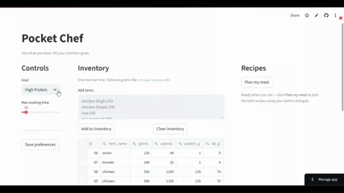

# Pocket Chef 🍳  
*An agentic meal planner that helps you cook with what you already have in your pantry.*



---

## ✨ Features
- **Pantry-first recipe planning** – suggest meals based on what you already have  
- **Nutrition-aware suggestions** – track macros, calories, and protein automatically  
- **LLM-powered substitutions & fallback ideas** – GPT-4-o-mini suggests realistic alternatives when you’re missing ingredients  
- **Inventory tracking** – powered by SQLite with automatic deductions after cooking  
- **Streamlit interface** – clean, interactive, and easy to use  

---

## 📸 Demo
**Team behind Pocket Chef:**  
   

[](https://drive.google.com/file/d/13tmXJ1SUA7AI__HTj2JRvUTPxbJsrA5s/view?usp=sharing)

[](https://pocket-chef.streamlit.app/)

---

## 🚀 Run Locally

Clone the repo and install dependencies:

```bash
git clone https://github.com/apurvavbaru/Pocket-Chef.git
cd Pocket-Chef
pip install -r requirements.txt
streamlit run Pocket_Chef.py ```

